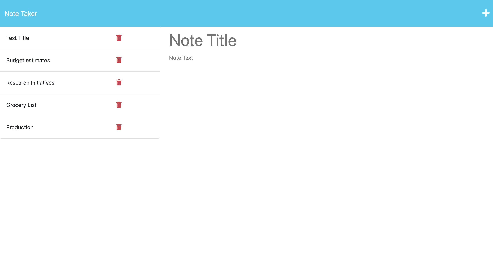
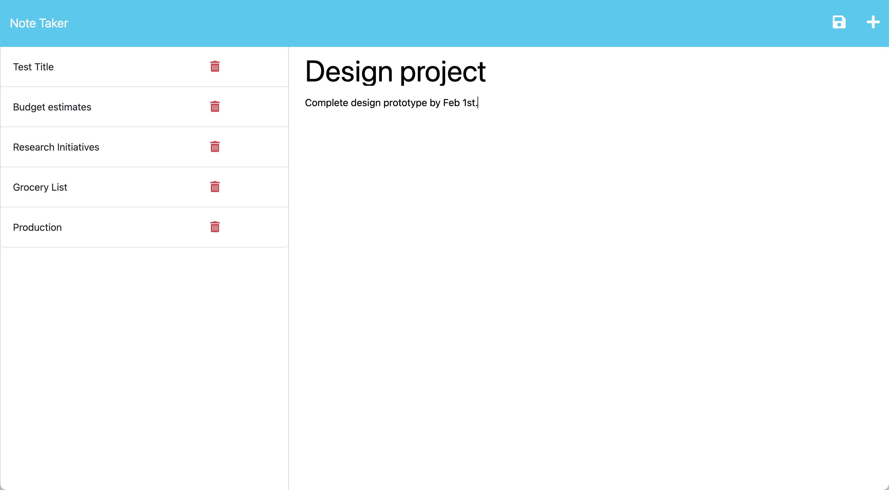

# Note-Taker
Express.js Challenge: Note Taker

## Description

This application can be used to write, save, and delete notes. This application uses an Express.js back end and will save and retrieve note data from a JSON file.

This application has a db.json file on the back end that is used to store and retrieve notes using the fs module.
The following HTML routes are included:
    GET /notes returns the notes.html file.
    GET * returns the index.html file.
The following API routes are created:
    GET /api/notes reads the db.json file and returns all saved notes as JSON.
    POST /api/notes receives a new note to save on the request body, adds it to the db.json file, and returns the new note to the client
Each note has a unique id when it's saved, using the uniqid npm package.

This application has a delete request functionality.
DELETE /api/notes/:id receives a query parameter containing the id of a note to delete. 
All the notes are read from the db.json file, the note with the given id property is removed, and the notes are rewritten to the db.json file.

### User Story

```
AS A small business owner
I WANT to be able to write and save notes
SO THAT I can organize my thoughts and keep track of tasks I need to complete
```

### Acceptance Criteria

```
GIVEN a note-taking application
WHEN I open the Note Taker
THEN I am presented with a landing page with a link to a notes page
WHEN I click on the link to the notes page
THEN I am presented with a page with existing notes listed in the left-hand column, plus empty fields to enter a new note title and the note’s text in the right-hand column
WHEN I enter a new note title and the note’s text
THEN a Save icon appears in the navigation at the top of the page
WHEN I click on the Save icon
THEN the new note I have entered is saved and appears in the left-hand column with the other existing notes
WHEN I click on an existing note in the list in the left-hand column
THEN that note appears in the right-hand column
WHEN I click on the Write icon in the navigation at the top of the page
THEN I am presented with empty fields to enter a new note title and the note’s text in the right-hand column
```

## Table of Contents

- [Installation](#installation)
- [Usage](#usage)
- [License](#license)
- [Features](#Features)

## Installation

The applications environment can be invoked through the command line using the following command:

```
node server.js
```

## Usage

Use the intergrated terminal to build a team and add as many members as needed.

The following images show the web application's appearance and functionality:





## License

This project is licensed under the MIT license. For more information on the MIT license, please use the following link: https://opensource.org/licenses/MIT.

## Features

1. JavaScript
2. Express.js
3. Node.js
4. npm
5. Bootstrap
6. Inquirer
7. JSON